# Waste2Taste

<div align="center">
  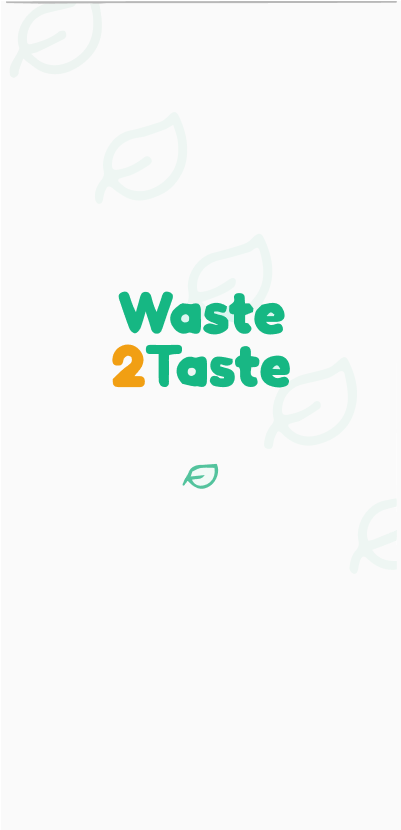
</div>

<div align="center">
  <h3>Food Rescue • Smart Surplus Food Marketplace</h3>
</div>

Waste2Taste is a Flutter-based food rescue application that connects food providers, restaurants, and users through a mobile marketplace for surplus and near-expiry food.

The goal is simple: reduce food waste, support sustainable consumption, and make food access easier through a clear and friendly user experience.

---

## ✨ Features

- Secure authentication flow for customers and vendors
- Product listing and food marketplace experience
- Map-based nearby rescue locations
- Order confirmation and order tracking flow
- User profile, settings, language selection, and dark-mode support
- Arabic and English localization
- Firebase-backed configuration and app services

---

## 🛠️ Tech Stack

- Flutter
- Dart
- Firebase
- Google Maps
- Flutter Bloc / Cubit
- GoRouter
- Dio
- Shared Preferences / Secure Storage
- Localization and theme support

---

## 🧱 Architecture

The project follows a feature-first layered architecture inspired by Clean Architecture and Flutter feature modularization.

```text
lib/
  Features/
    auth/
    home/
    map/
    orders/
    products/
    profile/
    report/
    splash/

  core/
    constants/
    cubits/
    database/
    enums/
    errors/
    extensions/
    functions/
    l10n/
    mappers/
    services/
    theme/
    usecase/
    utils/
    widgets/
```

Each feature is organized as:

```text
Features/
  feature_name/
    data/
    domain/
    presentation/
```

- `data`: models, repositories, API services, and data sources
- `domain`: entities, use cases, and business contracts
- `presentation`: screens, widgets, Cubits, and UI state handling

Shared services and app-wide utilities are centralized in the `core` layer.

---

## 🚀 Getting Started

### Install dependencies

```sh
flutter pub get
```

### Run the app

```sh
flutter run
```

### Run tests

```sh
flutter test
```

---

## 📸 Screenshots

<div align="center">
  <table>
    <tr>
      <td>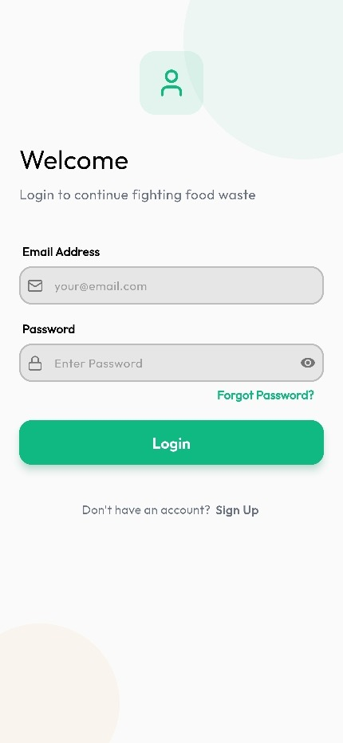</td>
      <td>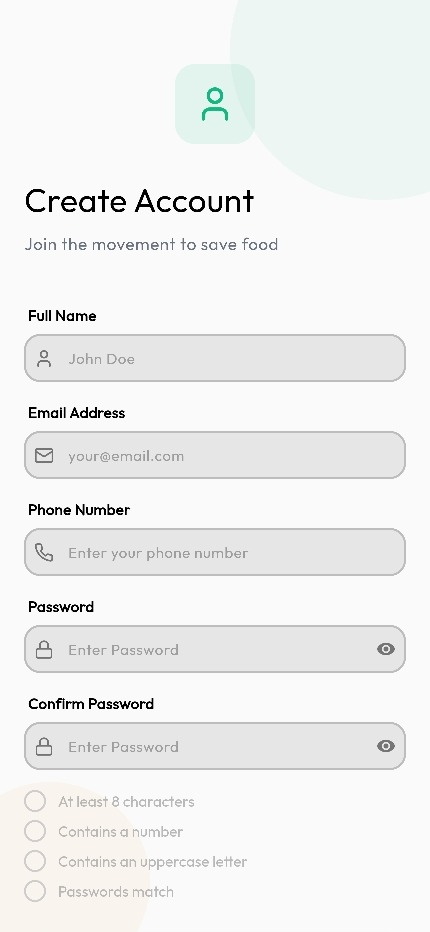</td>
      <td>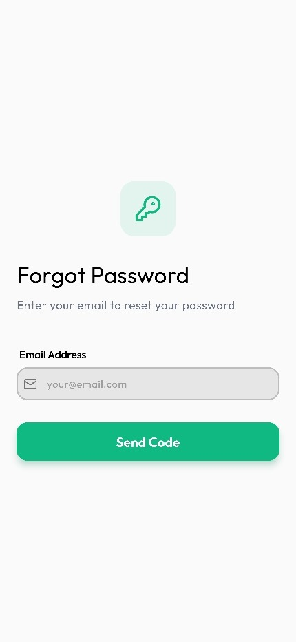</td>
    </tr>
    <tr>
      <td>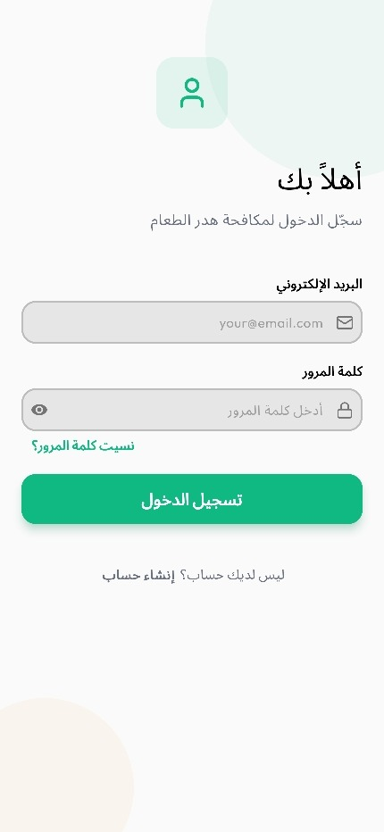</td>
      <td>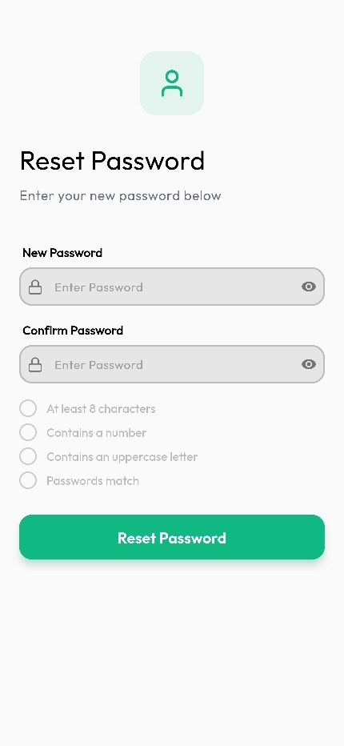</td>
      <td>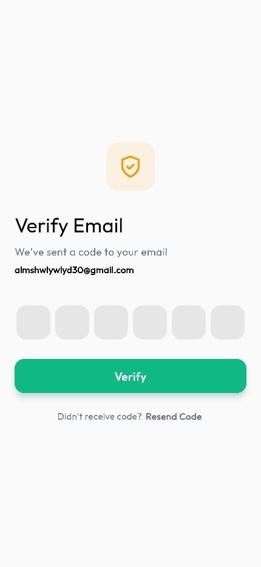</td>
    </tr>
    <tr>
      <td>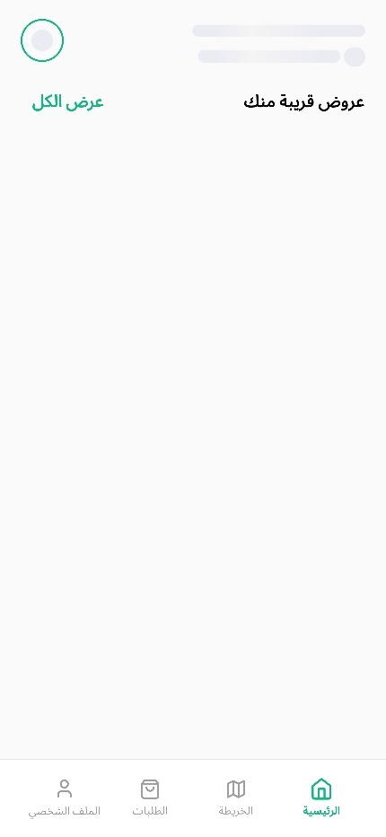</td>
      <td></td>
      <td>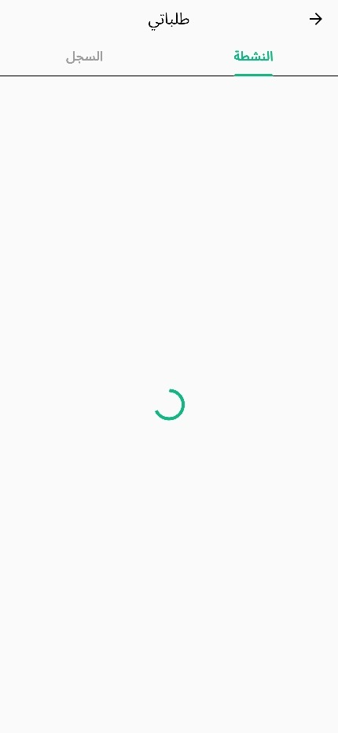</td>
    </tr>
    <tr>
      <td>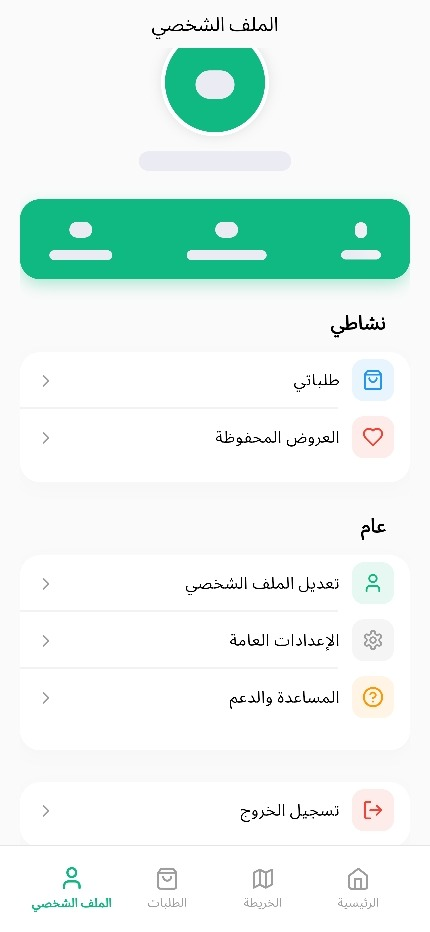</td>
      <td></td>
      <td>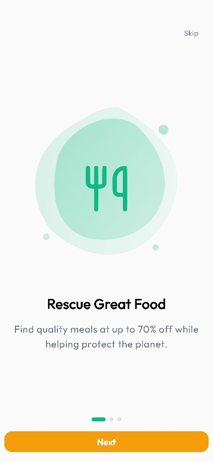</td>
    </tr>
  </table>
</div>

---

## ⚙️ Configuration

This project uses Flutter localization and Firebase configuration entries. Make sure the Firebase configuration file and required environment values are configured correctly before running the app.

---

## 🌍 App Goal

The main goal of Waste2Taste is to reduce avoidable food waste by helping users participate in a rescue and reuse flow that brings meals closer to people who need them while respecting the food supplier experience.
